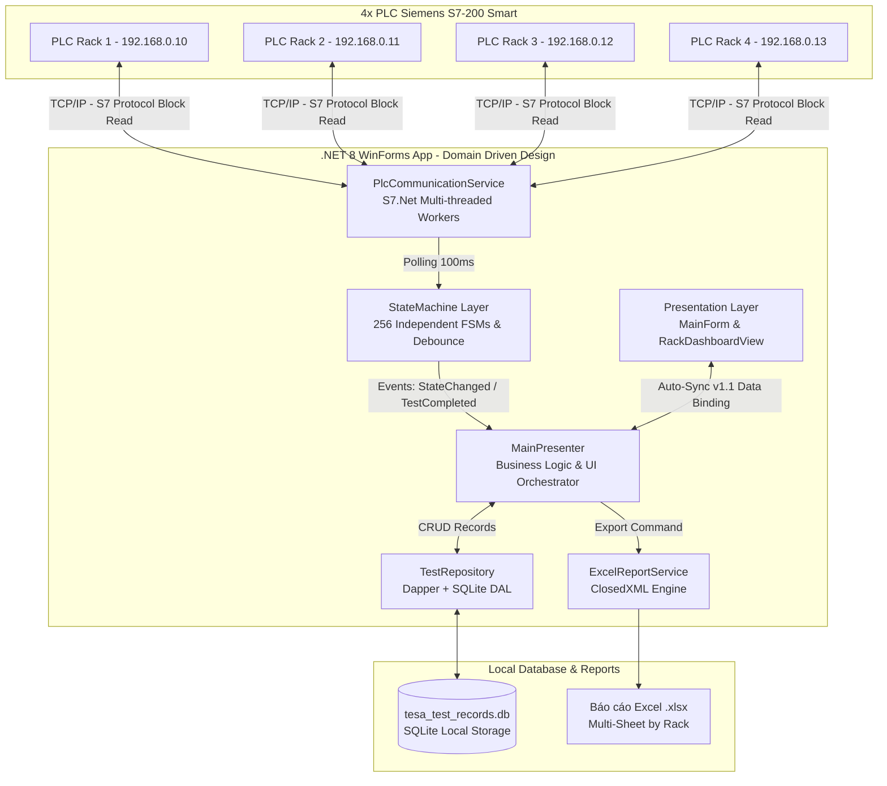

# BÁO CÁO KỸ THUẬT & HƯỚNG DẪN VẬN HÀNH: HỆ THỐNG THU THẬP DỮ LIỆU TESA HOLDING (TAPE ADHESION TEST)

---

## 1. Tổng quan dự án (Overview)

### 1.1. Dự án làm gì, phục vụ ai, giải quyết bài toán gì?
- **Dự án:** Ứng dụng tự động hóa giám sát, thu thập dữ liệu và xuất báo cáo cho các bài kiểm tra độ bám dính băng keo (**Tape Adhesion Test / Holding Power Test**).
- **Phục vụ ai:** Kỹ thuật viên phòng thí nghiệm (**Lab Operator**) và quản lý chất lượng (**QC Manager**) tại nhà máy tesa.
- **Bài toán giải quyết:**
  - Thay thế phương pháp theo dõi bằng mắt và ghi chép thủ công thời gian rơi tạ (Drop Time).
  - Tự động nhận diện thời điểm treo tạ (Bắt đầu test) và rớt tạ (Hoàn thành test) không cần nút bấm Start/Stop.
  - Quản lý đồng thời **256 vị trí đo** (4 Giàn x 4 Tầng x 16 Móc) qua mạng PLC công nghiệp với độ trễ gần như bằng 0 (< 1ms/vòng quét).
  - Chuẩn hóa báo cáo chất lượng ra file Excel tự động, tránh nhầm lẫn dữ liệu giữa các mẫu `Batch Code` và `NART Code`.

### 1.2. Trạng thái hiện tại
- **Trạng thái:** **Production** (Đang triển khai và vận hành thực tế tại phòng Lab nhà máy tesa).

### 1.3. Liên kết liên quan (Links & Documentation)
- **Tài liệu kỹ thuật PLC S7.Net:** [S7.NET Library Guide (PDF) - Siemens](https://www.ad.siemens.com.cn/club/bbs/upload/file/20181129/6367911382823920496914596.pdf)
- **Hỗ trợ kỹ thuật / Bảo trì:** Email: [treepoo2023@gmail.com](mailto:treepoo2023@gmail.com)

---

## 2. Kiến trúc hệ thống (Architecture)

### 2.1. Sơ đồ kiến trúc tổng thể


### 2.2. Tech Stack
- **Ngôn ngữ:** C# 12
- **Runtime & Framework:** .NET 8.0, WinForms (Windows 10/11 x64)
- **Giao tiếp PLC:** Thư viện `S7.Net 0.14.0` (TCP/IP S7 Protocol)
- **Cơ sở dữ liệu:** SQLite (`Microsoft.Data.Sqlite`, `Dapper` Micro-ORM)
- **Xuất Excel:** `ClosedXML 0.102.0` (Thao tác file .xlsx không cần cài MS Office)
- **Kiểm thử:** xUnit, FluentAssertions, Moq, Microsoft.NET.Test.Sdk

### 2.3. Các service/module chính và vai trò
| Module / Service | Đường dẫn file | Vai trò chính |
| :--- | :--- | :--- |
| `PlcCommunicationService` | `src/Core/PLC/PlcCommunicationService.cs` | Quản lý 4 kết nối TCP song song tới 4 giàn PLC. Thực hiện Block Reading đọc 64 ô nhớ mỗi giàn trong 1 lần request. |
| `StateMachine` | `src/Core/State/StateMachine.cs` | Máy trạng thái tự động đếm (`IDLE -> RUNNING -> COMPLETED`), tích hợp bộ chống nhiễu Debounce 300ms và Cold-start Guard. |
| `MainPresenter` | `src/UI/Presenters/MainPresenter.cs` | Cầu nối giữa UI và Core Logic, điều phối event, đồng bộ dữ liệu sửa đổi 2 chiều (Auto-Sync). |
| `TestRepository` | `src/Data/Database/TestRepository.cs` | DAL truy vấn SQLite bằng Dapper, tự động khởi tạo DB schema và chỉ mục (Index). |
| `ExcelReportService` | `src/Data/Export/ExcelReportService.cs` | Xuất file `.xlsx` tự động chia Sheet theo Rack, quy đổi đơn vị thời gian PLC sang Phút chuẩn. |

### 2.4. Luồng dữ liệu chính (Data Flow)
1. **Thu thập (Polling Loop 100ms):** `PlcCommunicationService` đọc một khối 256 byte (64 DWord) từ V-Memory của từng PLC.
2. **Xử lý trạng thái (FSM):** Dữ liệu được đưa vào 64 đối tượng `StateMachine`. Nếu PLC tăng nhịp -> `RUNNING`. Nếu tạ rơi đứng số 300ms -> `COMPLETED`.
3. **Lưu trữ & UI (Event & Dispatch):** Khi hoàn thành, event `OnTestCompleted` kích hoạt -> `MainPresenter` ghi bản ghi vào SQLite (`TestRepository`) -> Gọi `InvokeOnUI` cập nhật DataGridView và màu dòng hiển thị.

---

## 3. Cấu trúc thư mục (Project Structure)

### 3.1. Cây thư mục dự án
```text
tesa Holding Test Data Collection/
├── src/                                  # Mã nguồn chính của ứng dụng
│   ├── Core/                             # Business Logic & Hard-hardware integration
│   │   ├── Models/                       # Các thực thể nghiệp vụ (TestRecord, MeasurementRow...)
│   │   ├── PLC/                          # PlcCommunicationService, S7.Net wrapper
│   │   └── State/                        # StateMachine (FSM), bộ lọc nhiễu Debounce
│   ├── Data/                             # Data Access Layer & Report Generation
│   │   ├── Database/                     # TestRepository, kết nối SQLite, cấu hình Schema
│   │   └── Export/                       # ExcelReportService (ClosedXML)
│   ├── UI/                               # WinForms Presentation Layer
│   │   ├── Presenters/                   # MainPresenter (MVP Pattern)
│   │   ├── Views/                        # MainForm, ScannerForm, Controls (RackDashboardView)
│   │   └── Utils/                        # ControlExtensions (Double-buffered rendering)
│   └── TapeAdhesionApp.csproj            # File cấu hình dự án .NET 8.0
├── test/                                 # Bộ kiểm thử tự động
│   ├── UnitTests/                        # Kiểm thử đơn vị (StateMachine, DAL, MVP)
│   └── IntegrationTests/                 # Kiểm thử tích hợp rổ 2 (Chịu tải 64 móc, mô phỏng rớt cáp)
├── README.md                             # Tài liệu kỹ thuật & Hướng dẫn vận hành
└── TapeAdhesionApp.sln                   # Solution file
```

### 3.2. Quy ước đặt tên (Naming Conventions)
- **Class / Method / Property:** `PascalCase` (ví dụ: `PlcCommunicationService`, `ProcessValue()`, `DropTime`).
- **Private fields:** Prefix dấu gạch dưới `_camelCase` (ví dụ: `_lastValue`, `_unchangedCycles`).
- **UI Controls / Views:** Suffix mô tả chức năng `*Form`, `*View`, `*Control` (ví dụ: `RackDashboardView`).
- **Ngôn ngữ UI & Báo cáo:** Tiếng Việt có dấu chuẩn kỹ thuật xưởng (dễ đọc hiểu cho Lab Operator).

---

## 4. Hướng dẫn cài đặt môi trường (Setup)

### 4.1. Yêu cầu hệ thống
- **Hệ điều hành:** Windows 10 / Windows 11 (64-bit).
- **Runtime:** .NET 8.0 SDK hoặc .NET 8.0 Desktop Runtime.
- **Mạng công nghiệp:** Dải IP LAN nhà máy kết nối tới tủ PLC Siemens S7-200 Smart (Mặc định `192.168.0.10 - 192.168.0.13`, port `102`).

### 4.2. Các bước cài đặt từ đầu
Bạn có thể mở Terminal (PowerShell / CMD) và chạy tuần tự các lệnh sau:

```powershell
# 1. Clone repository về máy
git clone <repository-url>
cd "tesa Holding Test Data Collection"

# 2. Restore các gói NuGet dependencies (S7.Net, Dapper, ClosedXML, Microsoft.Data.Sqlite)
dotnet restore

# 3. Biên dịch toàn bộ Solution (Debug Mode)
dotnet build -c Debug
```

### 4.3. Cấu hình địa chỉ PLC & Môi trường
- Ứng dụng quản lý địa chỉ ô nhớ PLC linh hoạt ngay trên Giao diện UI:
  - Bấm nút **Global Settings** -> **Cấu hình địa chỉ PLC**.
  - Cho phép cấu hình địa chỉ V-Memory gốc (VD) và IP của từng Rack mà không cần sửa code hoặc compile lại.

### 4.4. Cơ sở dữ liệu mẫu & Migration tự động
- Cơ sở dữ liệu `tesa_test_records.db` **tự động khởi tạo** khi ứng dụng được bật lần đầu (`CREATE TABLE IF NOT EXISTS`).
- Không cần cài đặt server SQL hay chạy lệnh migration thủ công.
- Tích hợp sẵn tính năng **Sao lưu DB (Backup)** và **Khôi phục DB (Restore)** ngay trên thanh công cụ Tab Lịch sử.

---

## 5. Cách chạy và build

### 5.1. Chạy trong môi trường Development
```powershell
# Chạy ứng dụng WinForms ngay trên terminal
dotnet run --project src/TapeAdhesionApp.csproj
```

### 5.2. Chạy bộ kiểm thử tự động (Unit & Integration Tests)
```powershell
# Chạy toàn bộ Unit Test (StateMachine, Repository, DAL)
dotnet test test/UnitTests/UnitTests.csproj

# Chạy Rổ kiểm thử nghiệp vụ 2 (Chịu tải 64 móc đồng thời < 1ms, mô phỏng mất kết nối PLC)
dotnet run --project test/IntegrationTests/IntegrationTests.csproj
```

### 5.3. Build đóng gói Production Standalone (exe)
```powershell
# Đóng gói thành file .exe độc lập chạy trên máy Windows phòng Lab (không cần cài .NET SDK)
dotnet publish src/TapeAdhesionApp.csproj -c Release -r win-x64 --self-contained true -o ./publish
```

---

## 6. Database & Data Model

### 6.1. Mô hình thực thể (ERD / Schema Table `TestRecords`)
```sql
CREATE TABLE IF NOT EXISTS TestRecords (
    Id INTEGER PRIMARY KEY AUTOINCREMENT,
    RackId TEXT NOT NULL,           -- Định danh giàn (Rack1, Rack2...)
    Floor INTEGER NOT NULL,         -- Tầng (1..4)
    HookIndex INTEGER NOT NULL,     -- Thứ tự móc trên tầng (1..16)
    Location TEXT NOT NULL,         -- Định danh vị trí chuỗi (vd: Rack1-T1-M1)
    NartCode TEXT,                  -- Mã NART do Operator nhập
    BatchCode TEXT,                 -- Mã Batch do Operator nhập
    SamplePosition TEXT,            -- Vị trí mẫu trên tấm test
    Tester TEXT,                    -- Tên người thực hiện
    DropTime INTEGER NOT NULL,      -- Thời gian đo PLC (đơn vị 100ms ticks)
    PlcValue INTEGER NOT NULL,      -- Giá trị thanh ghi thô
    CompletedAt TEXT NOT NULL       -- Thời điểm rớt tạ (ISO-8601 UTC/Local)
);

-- Chỉ mục tối ưu hiệu năng truy vấn và bộ lọc lịch sử
CREATE INDEX IF NOT EXISTS IX_TestRecords_RackId ON TestRecords(RackId);
CREATE INDEX IF NOT EXISTS IX_TestRecords_CompletedAt ON TestRecords(CompletedAt);
CREATE INDEX IF NOT EXISTS IX_TestRecords_HookLookup ON TestRecords(RackId, Floor, HookIndex);
```

### 6.2. Cách xử lý Migration
- Thư viện `Dapper` thực thi DDL tự động trong phương thức `InitializeAsync()` của `TestRepository`.
- Khi bổ sung cột mới trong tương lai, chỉ cần thêm lệnh `ALTER TABLE TestRecords ADD COLUMN ...` có bẫy lỗi nhẹ nhàng trong khối khởi tạo.

---

## 7. Các module/tính năng quan trọng (Deep Dive - "Tại sao")

### 7.1. Finite State Machine (FSM) & Auto-Start / Debounce 300ms
- **Tại sao cần FSM:** Phòng Lab không muốn Operator phải bấm nút "Start/Stop" cho 256 móc vì rất dễ quên hoặc sai lệch thời điểm.
- **Logic tự động:**
  - `IDLE -> RUNNING`: Tự chuyển ngay lập tức khi đọc thấy thanh ghi PLC `> 0`.
  - **Debounce 300ms (`RUNNING -> COMPLETED`):** Cảm biến cơ khí nhà máy có thể rung lắc hoặc nhảy số khi tạ rơi. FSM chỉ chốt test hoàn thành khi số đo đứng im (`currentValue == lastValue`) trong **3 chu kỳ liên tiếp (300ms)**.
- **File liên quan:** `src/Core/State/StateMachine.cs`

### 7.2. Block Reading & Multi-Threaded Background Workers
- **Tại sao cần Block Reading:** Nếu gọi `S7.Net` đọc riêng lẻ 256 địa chỉ qua TCP, mạng sẽ nghẽn, độ trễ lên tới hàng giây -> UI đơ lag.
- **Giải pháp:** Sử dụng `ReadBytes()` đọc **1 khối duy nhất 256 byte** (64 DWord) cho mỗi giàn PLC trong thời gian < 1ms.
- **Cross-thread UI:** Các tác vụ mạng chạy trên Background Task, khi cập nhật UI luôn được bọc trong wrapper `InvokeOnUI()` (chống crash `Cross-thread operation not valid`).
- **File liên quan:** `src/Core/PLC/PlcCommunicationService.cs`

### 7.3. Auto-Sync v1.1 (Đồng bộ dữ liệu hai chiều lập tức)
- **Bài toán:** Operator thường nhập `Batch Code` và `NART Code` vào lúc tạ đang treo, hoặc phát hiện gõ nhầm *sau khi tạ đã rơi*.
- **Giải pháp:** Bất cứ khi nào ô nhập liệu trên bảng Dashboard thay đổi (`RowInfoChanged`), `MainPresenter` lập tức phát lệnh `UPDATE` ngược vào bản ghi DB gần nhất của móc đo đó. Báo cáo Excel luôn lấy đúng số liệu vừa cập nhật.
- **File liên quan:** `src/UI/Presenters/MainPresenter.cs`, `src/Data/Database/TestRepository.cs`

### 7.4. Cold-start Guard (Chống lặp dữ liệu khi khởi động lại App)
- **Bài toán:** Khi tắt App, PLC vẫn giữ số đo cũ (vd: `1800`) do tạ chưa reset về `0`. Khi mở lại App, nếu không có cơ chế chặn, FSM sẽ tưởng "tạ vừa rớt" và ghi thêm 1 bản ghi trùng lặp vào DB.
- **Giải pháp:** Cơ chế **Cold-start Guard** (`_isFirstValue`, `_suppressFirstComplete`) trong `StateMachine`. Khi khởi động, nếu phát hiện số PLC đứng im `> 0`, hệ thống tự chuyển thẳng trạng thái sang `COMPLETED` mà **không bắn sự kiện lưu DB**.
- **File liên quan:** `src/Core/State/StateMachine.cs`

### 7.5. Dynamic Excel Generation & Quy đổi thời gian chuẩn
- **Giải pháp:** Sử dụng `ClosedXML` tạo file `.xlsx` đa Sheet (`Rack1`, `Rack2`...).
- **Quy đổi thời gian:** PLC Siemens S7-200 Smart đếm nhịp 100ms (**1 phút = 600 nhịp ticks**). Báo cáo Excel tự động quy đổi `Math.Round(ticks / 600.0, 2)` ra đúng số Phút để Operator dễ đọc.
- **File liên quan:** `src/Data/Export/ExcelReportService.cs`

---

## 8. Authentication/Authorization & bảo mật

### 8.1. Phân quyền & Đăng nhập
- Hiện tại ứng dụng được vận hành nội bộ trong phòng thí nghiệm an toàn của nhà máy tesa (không tiếp xúc Internet).
- Định danh người thực hiện kiểm tra được gán trực tiếp qua cột `Tester` trên bảng đo.

### 8.2. Bảo mật dữ liệu & Sao lưu
- **Cơ sở dữ liệu:** File `tesa_test_records.db` lưu trong thư mục làm việc nội bộ máy tính Lab.
- **Thao tác an toàn:** Trang bị nút **Sao lưu DB** và **Khôi phục DB** trên thanh công cụ Tab Lịch sử, giúp bảo vệ dữ liệu trước các sự cố nguồn điện hoặc cài lại Windows.

---

## 9. Tích hợp bên thứ ba (Third-party Integrations)

### 9.1. Giao thức PLC Siemens S7-200 Smart
- **Thư viện:** `S7.Net 0.14.0`
- **Tài liệu tham khảo kỹ thuật:** [S7.NET Library Guide (PDF) - Siemens](https://www.ad.siemens.com.cn/club/bbs/upload/file/20181129/6367911382823920496914596.pdf)
- **Cấu hình mạng:**
  - Giao thức S7 qua cổng TCP `102`.
  - Quản lý 4 socket độc lập đồng thời cho 4 Rack PLC (`192.168.0.10`, `192.168.0.11`, `192.168.0.12`, `192.168.0.13`).

---

## 10. Testing

### 10.1. Chiến lược kiểm thử & Coverage
Hệ thống được chứng minh hoạt động thực tế qua 2 rổ kiểm thử tự động:
1. **Unit Test (`test/UnitTests`):** Kiểm tra chính xác 100% logic FSM (đếm nhịp, debounce, transition), truy vấn Dapper SQLite, và tương tác MVP.
2. **Integration & Performance Test (`test/IntegrationTests`):**
   - `[PLC-01]` Mô phỏng ngắt kết nối PLC đột ngột: App phát hiện mất mạng, ném ngoại lệ an toàn, không crash, tự nối lại khi có mạng.
   - `[PERF-03]` Chịu tải xử lý 64 Hook đồng loạt: Thời gian xử lý 1 vòng quét 64 móc trung bình tốn **0.0010 ms** (yêu cầu < 100 ms). CPU siêu nhẹ (< 1%).

### 10.2. Lệnh chạy kiểm thử nhanh
```powershell
dotnet test test/UnitTests/UnitTests.csproj --verbosity normal
dotnet run --project test/IntegrationTests/IntegrationTests.csproj
```

---

## 11. Deployment & CI/CD

### 11.1. Quy trình triển khai (Deployment Flow)
1. Biên dịch ứng dụng sang gói Standalone Executable cho Windows x64 bằng lệnh `dotnet publish`.
2. Chép toàn bộ thư mục `publish` vào máy tính trạm (Windows PC) tại phòng Lab tesa.
3. Tạo Shortcut ứng dụng `TapeAdhesionApp.exe` ra màn hình Desktop cho Lab Operator.

### 11.2. Kế hoạch Rollback khi lỗi
- Khi cập nhật phiên bản mới, nén thư mục chạy hiện tại thành `backup_v1.x.zip` và dùng nút **Sao lưu DB** để chốt bản sao dữ liệu.
- Nếu phiên bản mới có sự cố, chỉ cần giải nén bản cũ và chạy tiếp ngay lập tức.

---

## 12. Monitoring & Logging

### 12.1. Công cụ theo dõi trực quan trên UI
- **StatusStrip:** Báo cáo trạng thái kết nối PLC theo thời gian thực (Màu xanh Connected / Màu đỏ Offline + thông báo).
- **Tab Quản lý PLC:** Hiển thị Card trạng thái cho 4 Rack, hỗ trợ nút **Kết nối lại (Retry)** khi có sự cố mạng.
- **Màu sắc bảng Dashboard (Color Coding):**
  - `Trắng`: IDLE (Đang rảnh/chờ đo).
  - `Xanh lá`: RUNNING (Đang đo đếm nhịp PLC).
  - `Đỏ Tesa`: COMPLETED (Đã rớt tạ, hoàn thành bài test).

---

## 13. Known Issues & Technical Debt

### 13.1. Các vấn đề kỹ thuật đã xử lý thành công
- **Độ trễ hiển thị màu trên Dashboard:** Đã tối ưu bằng `InvalidateRow()` khi trạng thái thay đổi, loại bỏ hoàn toàn độ trễ màu sắc.
- **Sắp xếp bảng Lịch sử (DataGridView History):** Đã tắt tự sinh cột, hiển thị 8 cột Việt hóa và áp dụng sắp xếp đa tầng: `CompletedAt DESC -> RackId -> Floor -> HookIndex`.
- **Đồng bộ thời gian:** Sửa lỗi chia đơn vị `0.03 phút` thành `3.00 phút` (`ticks / 600.0`), khớp 100% giữa Dashboard, Lịch sử và Excel.

### 13.2. Nợ kỹ thuật / Kế hoạch mở rộng (Future Roadmap)
- Mở rộng thêm tính năng quản lý tài khoản người dùng (Login/PIN Code) nếu nhà máy có nhu cầu phân cấp quyền Xóa/Sửa bản ghi.
- Đồng bộ cơ sở dữ liệu từ SQLite cục bộ lên máy chủ SQL Server tổng của nhà máy tesa (nếu kết nối mạng nội bộ giữa Lab và IT cho phép).

---

## 14. Liên hệ & Tài nguyên khác

### 14.1. Liên hệ Kỹ thuật & Bảo trì
- **Kỹ sư phát triển & Bảo trì hệ thống:** [treepoo2023@gmail.com](mailto:treepoo2023@gmail.com)
- **Tên dự án:** tesa Holding Test Data Collection System

### 14.2. Tài liệu bổ sung & Thư viện
- **Tài liệu hướng dẫn thư viện S7.Net (PDF):** [https://www.ad.siemens.com.cn/club/bbs/upload/file/20181129/6367911382823920496914596.pdf](https://www.ad.siemens.com.cn/club/bbs/upload/file/20181129/6367911382823920496914596.pdf)
- **Quy chuẩn kỹ thuật kiểm tra bám dính băng keo:** Tuân thủ theo tiêu chuẩn nội bộ phòng Lab nhà máy tesa.
